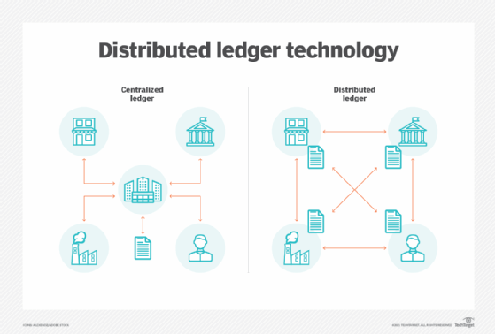

# Uses

Many companies in a number of industries have took advantage of DLT and have been revolutionized, for example:&#x20;

* Healthcare       :hospital:                                                                               &#x20;
* Voting      :white\_check\_mark:
* Financial Services    :moneybag:
* Real Estate     :homes:
* Law    :scales:
* Retail     :shopping\_bags:

and many more.

**Charities** - A number of organizations like The World Food Program(WFP) are currently using a blockchain-based system for payment of delivery of food aid to Syrian refugees. This system runs on a permissioned protocol controlled by the WFP with funds ultimately payed in sovereign currency, which distinguishes it from cryptocurrency. This system has reduced transaction costs by 98%.&#x20;

**Trade Finance** - Smart contract can be adopted by registered exchanges in permissioned protocols that use sovereign money as backing, simplifying administrative processes related to complex financial transactions, such as trade finance. Trade finance is costly and cumbersome, involving multiple document exchanges between the parties to a transaction. Distributed Ledger Technology (DLT) could simplify the execution of the underlying contracts by automatically releasing payment to the exporter upon the addition of a valid bill of lading to the ledger.&#x20;

**Electricity** - Pro-active consumers or (prosumers) as some people call them may be in a position to contribute to renewable energy production and would even be possible to trade with other consumers through DLT as the market moves from a highly centralized structure with relatively few participants to a much more decentralized structure with an extremely large number of participants. Also, the individual household no longer classifies as a single homogeneous entity, but consists of an assortment individual appliances that consume or in some cases, store or generate power. DLT will allow these appliances to respond to remote signals and make decisions about their consumption, storage and power generation.&#x20;

**Law Technology** - DLT and smart contracts look to impact a number of aspects of the legal industry and lawyers should be facilitating, not impeding this transformation. While certain segments of the market may become significantly disrupted, entire new markets for legal services will emerge. Like if a smart contract should self-execute adverse to the parties intent, demand for expertise surrounding what resources might be available to remedy the problem that will develop. A number of rapidly growing applications have begun to emerge that incorporate DLT to streamline the practise of law. Applications include platforms for drafting and maintaining a number of agreements, including non-disclosure agreements and leases, along with process-service tools that provide courts, law firms, governing bodies and parties to a case with access to verifiable, untampered service of process data.&#x20;

